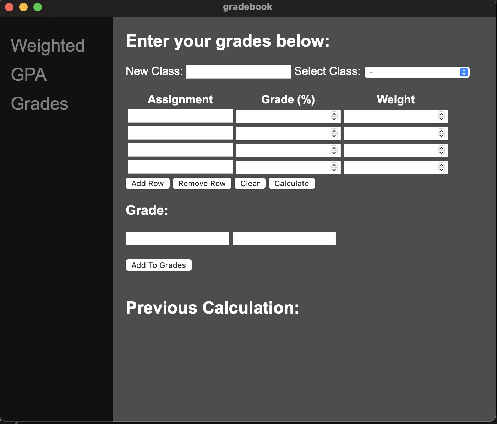
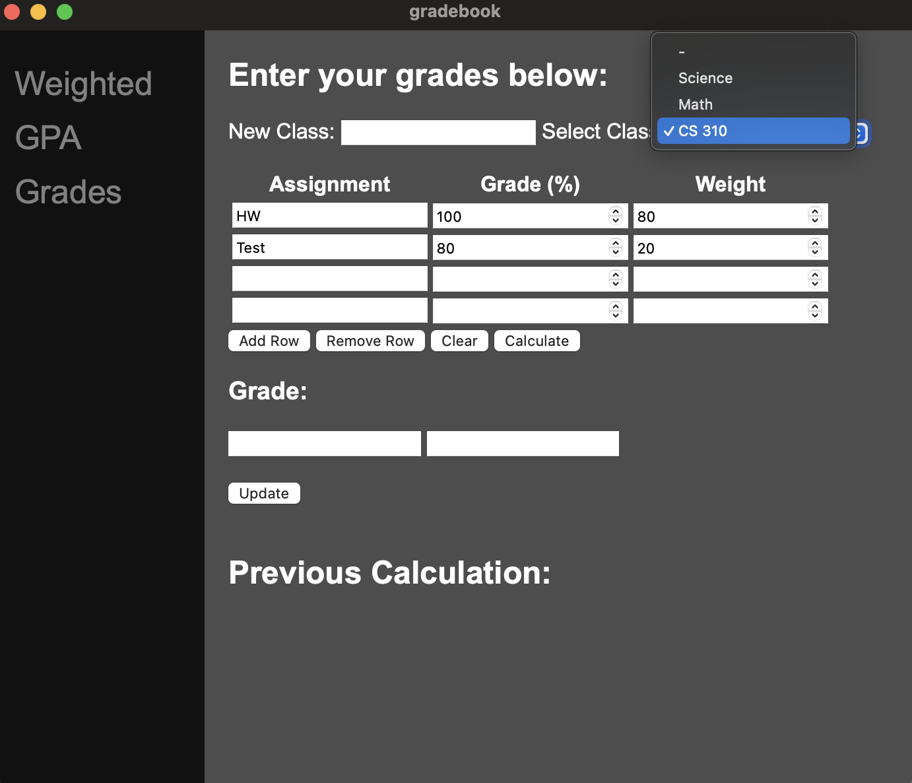
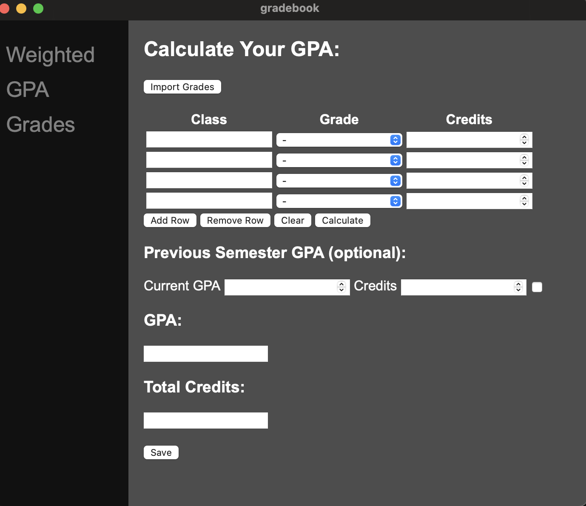
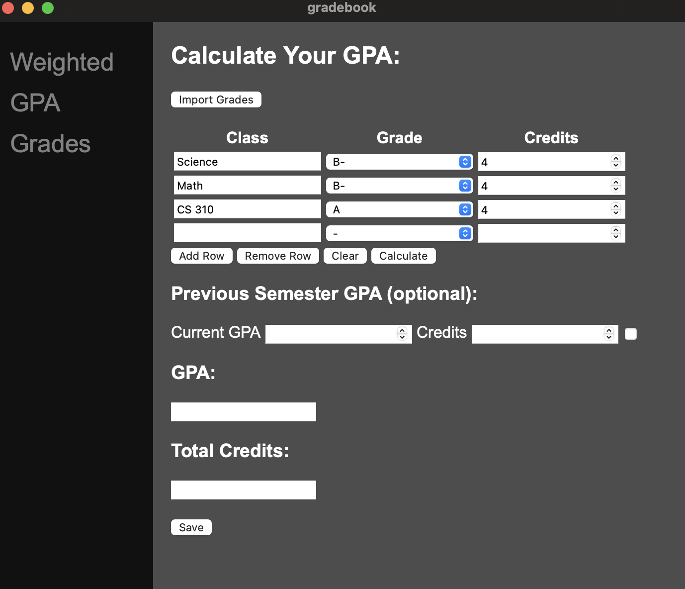
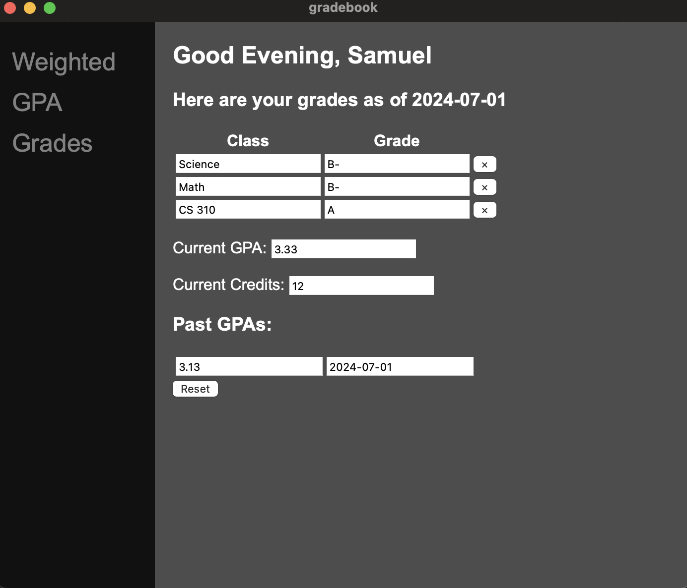

# GradeBook
This app has been my summer project for the past month. It is a desktop app created using the tauri framework. Rust is the backend for this project and I used vanilla JS, HTML, and CSS for the front end. The front end design is very basic as that was not the focus of this project. I used a locally hosted PostGreSQL database.

This project was inspired by having to keep reentering grades into grade calculators and only being able to see one class at a time and if I wanted to change classes then I would have to reenter in the weights and keep looking back and fourth at the sylabus. This project aimed to make my life more convient and I plan on releaseing a web version before the end of the summer. I also plan on getting the desktop version to become downloadable so that if you prefer a desktop app you have that option too. Of course both will be synced so no matter the platform the option is there and cross platform. 

--- 

### What is GradeBook
GradeBook is an application that easily allows users to keep track and update their grades. There is the option to add as many classes as you would like. Updating grades for a class is easy because all the classes are saved. There is a GPA calculator as well which with a click of a button imports all your currently stored classes and grades and allows you to easily calculate your GPA. There is also an option to input past GPA's and by default if there is a GPA saved, it will automatically show up as an optional calculation. The grades section displays all of your current classes and grades associated with them as well as your current GPA and credits and a list of all you past GPA's with the dates they were calculated.

